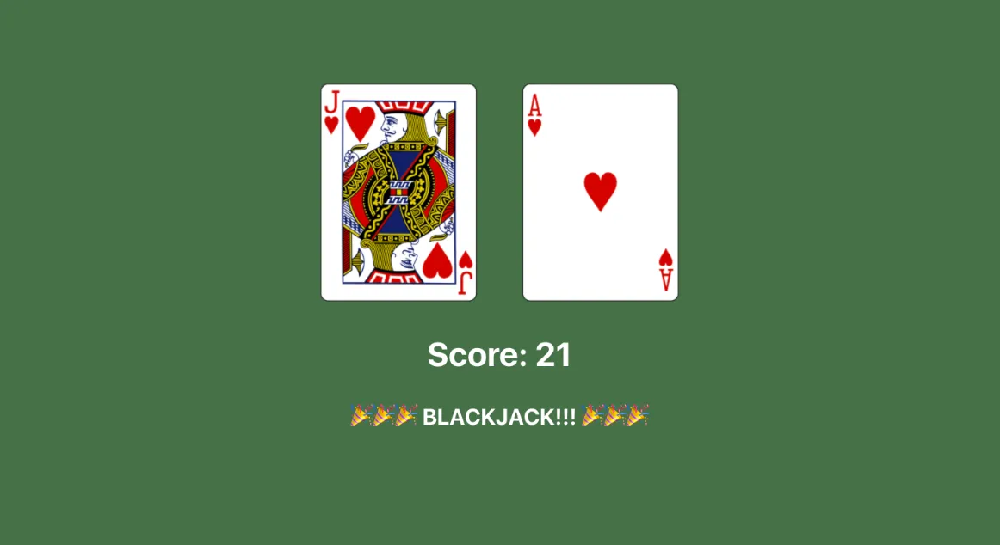

# React + Vite

React Props: Pokedex

eslint-plugin-react-hooks
node version: "^5.1.0-rc.0"


To Run:
```sh
npm install
npm run dev
```

---

## **Further Study: Basic Blackjack!**

Blackjack is a popular card game. You don’t know enough about React to build your own blackjack game yet, but you know enough to handle the beginning of the game.

Build a React app that automatically deals you two cards from a 52-card deck. Each card has a score assigned to it: aces will be worth 11; tens, jacks, queens, and kings will be worth 10; every other card will be worth its value (twos will be worth 2, threes will be worth 3, etc.)

Using URLs from the Deck of Cards API (e.g. ), show images of the two random cards on the page, along with the total score for those two cards. If the score is 21, show an additional message letting the user know that they have blackjack!

Note that the two cards you display must be different. You also don’t need to worry about any other functionality from the game of blackjack. If you want different cards, you’ll have to refresh the page.

Here’s an image of what the app might look like:



